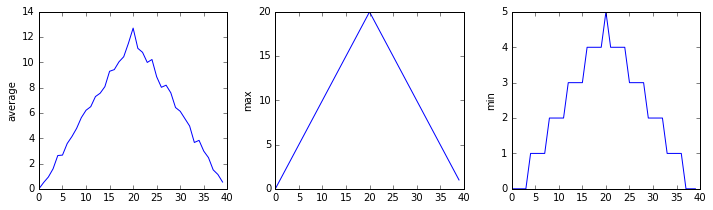
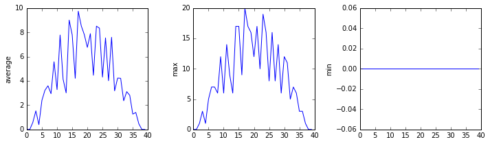

**up to now:** 
* we've written code to draw out some interesting featurs on the inflammation, 
* looped over our data files to draw plots, 
* and have python to make decisions based on conditions related to the data. 

**problem is**
* our code is getting long an complicated
* what if we had 1k's of datasets, but didnt' want to generate plots on every one? (commenting the code out will become a nuisance)
* What about reusing the code on a diff. dataset or at a diff. point in the program? (cutting and pasting is going make code longer and repetitive)

**need a way to package our code for reuse**
* this way in python is thru functions
* Python lets us define functions - a shorthand way of re-executing code. 


*** Let's write function to convert from fahrenheit to kelvin**


```python
import numpy
import matplotlib.pyplot
```


```python
def fahr_to_kelvin(temp):
    return ((temp - 32) * (5/9)) + 273.15
```


* use `def` followed by function name and parenthesized list of parameter names
* we `call` a function and the values we pass it are assigned to those varialbes so we can use inside 
* use return statement to send back result

We can now try our function out! 


```python
print('freezing point of water:', fahr_to_kelvin(32))
print('boiling point of water:', fahr_to_kelvin(212))

```

    freezing point of water: 273.15
    boiling point of water: 373.15


* We've successfully called the funtion we defined
* Now we have acces to the result

## Inter division part - need to add

### Composing Functions

Now we've seen how to turn Fahrenheit to Kelvin, its easy to turn kelvin into celsius


```python
def kelvin_to_celsius(temp_k):
    return temp_k - 273.15

print('absolute zero in Celsius:', kelvin_to_celsius(0.0))
```

    absolute zero in Celsius: -273.15


What about Fahrenheit to Celsius? 
* we could write out the forumla, but we don't need to 
* we can compose the two functions we have already created 


```python
def fahr_to_celsius(temp_f):
    temp_k = fahr_to_kelvin(temp_f)
    result = kelvin_to_celsius(temp_k)
    return result

print('freezing point of water in Celsius:', fahr_to_celsius(32.0))

```

    freezing point of water in Celsius: 0.0


first taste of how larger programs are built:
* we define basic operations
* combine them in ever-larger chunks 

## Challenge - function: 
“Adding” two strings produces their concatenation: 'a' + 'b' is 'ab'. Write a function called fence that takes two parameters called original and wrapper and returns a new string that has the wrapper character at the beginning and end of the original. A call to your function should look like this:

print(fence('name', '*'))


```python
def fence(original, wrapper):
    return wrapper + original + wrapper

print(fence('name', '*'))
```

    *name*


## Combining & tidying up
* now we know how to write functions, we can make our analysis easier to read
* first lest make an analyze function that generate our plots


```python
def analyze(filename):

    data = numpy.loadtxt(fname=filename, delimiter=',')

    fig = matplotlib.pyplot.figure(figsize=(10.0, 3.0))

    axes1 = fig.add_subplot(1, 3, 1)
    axes2 = fig.add_subplot(1, 3, 2)
    axes3 = fig.add_subplot(1, 3, 3)

    axes1.set_ylabel('average')
    axes1.plot(data.mean(axis=0))

    axes2.set_ylabel('max')
    axes2.plot(data.max(axis=0))

    axes3.set_ylabel('min')
    axes3.plot(data.min(axis=0))

    fig.tight_layout()
    matplotlib.pyplot.show(fig)
```

add another function called detect_problems that checks for those systematics we noticed:


```python
def detect_problems(filename):

    data = numpy.loadtxt(fname=filename, delimiter=',')

    if data.max(axis=0)[0] == 0 and data.max(axis=0)[20] == 20:
        print('Suspicious looking maxima!')
    elif data.min(axis=0).sum() == 0:
        print('Minima add up to zero!')
    else:
        print('Seems OK!')
```

* notice this code is more readable 
* we can reproduce the previous analysis with a much simplier for loop:


```python
import glob
import numpy
import matplotlib.pyplot
%matplotlib inline
```


```python
filenames = glob.glob('data/inflammation*.csv')
```


```python
for f in filenames[:3]:
    print(f)
    analyze(f)
    detect_problems(f)
```

    data/inflammation-01.csv


    Suspicious looking maxima!
    data/inflammation-02.csv





    Suspicious looking maxima!
    data/inflammation-03.csv





    Minima add up to zero!


* Notice that rather than jumbling this code together in giant for loop, we can now read and resue both ideas separately
* We can reproduce the prvious analysis with a much simplier for loop

## Challenge - functions 2: 

If the variable s refers to a string, then s[0] is the string’s first character and s[-1] is its last. Write a function called outer that returns a string made up of just the first and last characters of its input. A call to your function should look like this:

```python
print(outer('helium'))
```


```python
def outer(input_string):
    return input_string[0] + input_string[-1]

print(outer('helium'))
```

    hm


### Testing and Documenting 

* Once start using functions for reuse, we need to start testing them
* Let's write a function to center a dataset around a particular value


```python
def center(data, desired):
    return (data - data.mean()) + desired
```

* since we don't know what values ought to be in our data let's create a matrix of zeros and center around 3.


```python
z = numpy.zeros((2,2))
print(center(z, 3))
```

    [[ 3.  3.]
     [ 3.  3.]]


* looks good, now let's try and center our real data


```python
data = numpy.loadtxt(fname='data/inflammation-01.csv', delimiter=',')
print(center(data, 0))
```

    [[-6.14875 -6.14875 -5.14875 ..., -3.14875 -6.14875 -6.14875]
     [-6.14875 -5.14875 -4.14875 ..., -5.14875 -6.14875 -5.14875]
     [-6.14875 -5.14875 -5.14875 ..., -4.14875 -5.14875 -5.14875]
     ..., 
     [-6.14875 -5.14875 -5.14875 ..., -5.14875 -5.14875 -5.14875]
     [-6.14875 -6.14875 -6.14875 ..., -6.14875 -4.14875 -6.14875]
     [-6.14875 -6.14875 -5.14875 ..., -5.14875 -5.14875 -6.14875]]


* hard to tell from the output if the result correct, let's test


```python
print('original min, mean, and max are:', data.min(), data.mean(), data.max())
centered = center(data, 0)
print('min, mean, and and max of centered data are:', centered.min(), centered.mean(), centered.max())

```

    original min, mean, and max are: 0.0 6.14875 20.0
    min, mean, and and max of centered data are: -6.14875 2.84217094304e-16 13.85125


* seems right, original mean 6.1 and lower bound from zero is  -6.1
* we can check standard deviation 


```python
print('std dev before and after:', data.std(), centered.std())
```

    std dev before and after: 4.61383319712 4.61383319712


* those values look the same but we probably wouldn't notice if they weren't further out 
* let's take the diff


```python
print('difference in standard deviations before and after:', data.std() - centered.std())
```

    difference in standard deviations before and after: 0.0


* difference is zero
* before we get back to our analysis let's add documentation 
* documentation is not only good for collaborators, but also the future you
* we can add doc this way


```python
# center(data, desired): return a new array containing the original data centered around the desired value.
def center(data, desired):
    return (data - data.mean()) + desired

```

* better way: if the first thing in a function is a string that isn't assigned 
* that string is attached to the function as documentation


```python
def center(data, desired):
    '''Return a new array containing the original data centered around the desired value.'''
    return (data - data.mean()) + desired
```

better because we can now ask python's built-in help to show us the documentation


```python
help(center)
```

    Help on function center in module __main__:
    
    center(data, desired)
        Return a new array containing the original data centered around the desired value.
    


* a string like this is called the docstring
* we don't need to use 3 quotes when we write one but if we do we can use multiple lines


```python
def center(data, desired):
    '''Return a new array containing the original data centered around the desired value.
    Example: center([1, 2, 3], 0) => [-1, 0, 1]'''
    return (data - data.mean()) + desired

help(center)
```

    Help on function center in module __main__:
    
    center(data, desired)
        Return a new array containing the original data centered around the desired value.
        Example: center([1, 2, 3], 0) => [-1, 0, 1]
    


## Defining Defaults

* we have passed parameters to functions in two ways: 
  * directly as in type(data)
  * and by name as in numpy.loadtxt(fname='something.csv', delimiter=',')
* we can pass the filename to loadtext without the filename


```python
numpy.loadtxt('data/inflammation-01.csv', delimiter=',')

```


    array([[ 0.,  0.,  1., ...,  3.,  0.,  0.],
           [ 0.,  1.,  2., ...,  1.,  0.,  1.],
           [ 0.,  1.,  1., ...,  2.,  1.,  1.],
           ..., 
           [ 0.,  1.,  1., ...,  1.,  1.,  1.],
           [ 0.,  0.,  0., ...,  0.,  2.,  0.],
           [ 0.,  0.,  1., ...,  1.,  1.,  0.]])


but we still need the `delimiter=`:


```python
numpy.loadtxt('data/inflammation-01.csv', ',')
```


    ---------------------------------------------------------------------------

    TypeError                                 Traceback (most recent call last)

    <ipython-input-15-7924d6313a1e> in <module>()
    ----> 1 numpy.loadtxt('data/inflammation-01.csv', ',')
    

    /Users/jtdennis/anaconda/envs/py35/lib/python3.5/site-packages/numpy/lib/npyio.py in loadtxt(fname, dtype, comments, delimiter, converters, skiprows, usecols, unpack, ndmin)
        871     try:
        872         # Make sure we're dealing with a proper dtype
    --> 873         dtype = np.dtype(dtype)
        874         defconv = _getconv(dtype)
        875 


    TypeError: data type "," not understood


* to understand what's going on and make our functions easier to use
* let's re-define our `center` function like this:


```python
def center(data, desired=0.0):
    '''Return a new array containing the original data centered around the desired value (0 by default).
    Example: center([1, 2, 3], 0) => [-1, 0, 1]'''
    return (data - data.mean()) + desired
```

* key change is the second parameter is now written `desired=0.0`
* if we call the function with two arguments, it works as it did before


```python
test_data = numpy.zeros((2, 2))
print(center(test_data, 3))
```

    [[ 3.  3.]
     [ 3.  3.]]


* but we can now call it with just one parameter
* in this case desired is automatically assigned the default value of 0.0


```python
more_data = 5 + numpy.zeros((2, 2))
print('data before centering:')
print(more_data)
print('centered data:')
print(center(more_data))
```

    data before centering:
    [[ 5.  5.]
     [ 5.  5.]]
    centered data:
    [[ 0.  0.]
     [ 0.  0.]]


this is handy: 
* if we want a function to work one way, but occasionally need it to do something else, we can allow people to pass a diff parameter when they need to but provide a default

* below example shows how python matches values to parameters:


```python
def display(a=1, b=2, c=3):
    print('a:', a, 'b:', b, 'c:', c)

print('no parameters:')
display()
print('one parameter:')
display(55)
print('two parameters:')
display(55, 66)
```

    no parameters:
    a: 1 b: 2 c: 3
    one parameter:
    a: 55 b: 2 c: 3
    two parameters:
    a: 55 b: 66 c: 3


* as this shows parameters are matched up from left to right
* any that haven't been given a value explicitly get their default value


```python
# we can override this behavior by naming value as we pass it in
print('only setting the value of c')
display(c=77)
```

    only setting the value of c
    a: 1 b: 2 c: 77


Let's now look at numpy.loadtext:


```python
help(numpy.loadtxt)
```

    Help on function loadtxt in module numpy.lib.npyio:
    
    loadtxt(fname, dtype=<class 'float'>, comments='#', delimiter=None, converters=None, skiprows=0, usecols=None, unpack=False, ndmin=0)
        Load data from a text file.
        
        Each row in the text file must have the same number of values.
        
        Parameters
        ----------
        fname : file or str
            File, filename, or generator to read.  If the filename extension is
            ``.gz`` or ``.bz2``, the file is first decompressed. Note that
            generators should return byte strings for Python 3k.
        dtype : data-type, optional
            Data-type of the resulting array; default: float.  If this is a
            structured data-type, the resulting array will be 1-dimensional, and
            each row will be interpreted as an element of the array.  In this
            case, the number of columns used must match the number of fields in
            the data-type.
        comments : str or sequence, optional
            The characters or list of characters used to indicate the start of a
            comment;
            default: '#'.
        delimiter : str, optional
            The string used to separate values.  By default, this is any
            whitespace.
        converters : dict, optional
            A dictionary mapping column number to a function that will convert
            that column to a float.  E.g., if column 0 is a date string:
            ``converters = {0: datestr2num}``.  Converters can also be used to
            provide a default value for missing data (but see also `genfromtxt`):
            ``converters = {3: lambda s: float(s.strip() or 0)}``.  Default: None.
        skiprows : int, optional
            Skip the first `skiprows` lines; default: 0.
        usecols : sequence, optional
            Which columns to read, with 0 being the first.  For example,
            ``usecols = (1,4,5)`` will extract the 2nd, 5th and 6th columns.
            The default, None, results in all columns being read.
        unpack : bool, optional
            If True, the returned array is transposed, so that arguments may be
            unpacked using ``x, y, z = loadtxt(...)``.  When used with a structured
            data-type, arrays are returned for each field.  Default is False.
        ndmin : int, optional
            The returned array will have at least `ndmin` dimensions.
            Otherwise mono-dimensional axes will be squeezed.
            Legal values: 0 (default), 1 or 2.
        
            .. versionadded:: 1.6.0
        
        Returns
        -------
        out : ndarray
            Data read from the text file.
        
        See Also
        --------
        load, fromstring, fromregex
        genfromtxt : Load data with missing values handled as specified.
        scipy.io.loadmat : reads MATLAB data files
        
        Notes
        -----
        This function aims to be a fast reader for simply formatted files.  The
        `genfromtxt` function provides more sophisticated handling of, e.g.,
        lines with missing values.
        
        .. versionadded:: 1.10.0
        
        The strings produced by the Python float.hex method can be used as
        input for floats.
        
        Examples
        --------
        >>> from io import StringIO   # StringIO behaves like a file object
        >>> c = StringIO("0 1\n2 3")
        >>> np.loadtxt(c)
        array([[ 0.,  1.],
               [ 2.,  3.]])
        
        >>> d = StringIO("M 21 72\nF 35 58")
        >>> np.loadtxt(d, dtype={'names': ('gender', 'age', 'weight'),
        ...                      'formats': ('S1', 'i4', 'f4')})
        array([('M', 21, 72.0), ('F', 35, 58.0)],
              dtype=[('gender', '|S1'), ('age', '<i4'), ('weight', '<f4')])
        
        >>> c = StringIO("1,0,2\n3,0,4")
        >>> x, y = np.loadtxt(c, delimiter=',', usecols=(0, 2), unpack=True)
        >>> x
        array([ 1.,  3.])
        >>> y
        array([ 2.,  4.])
    


lots of info but look at this part:

``` python
loadtxt(fname, dtype=<type 'float'>, comments='#', delimiter=None, converters=None, skiprows=0, usecols=None,
        unpack=False, ndmin=0)
```

* tells us that `loadtxt` has one parameter called `fname` that doesn't have a default value, & 8 others that do
* if we call the function like this:


```python
numpy.loadtxt('data/inflammation-01.csv', ',')
```


    ---------------------------------------------------------------------------

    TypeError                                 Traceback (most recent call last)

    <ipython-input-21-7924d6313a1e> in <module>()
    ----> 1 numpy.loadtxt('data/inflammation-01.csv', ',')
    

    /Users/jtdennis/anaconda/envs/py35/lib/python3.5/site-packages/numpy/lib/npyio.py in loadtxt(fname, dtype, comments, delimiter, converters, skiprows, usecols, unpack, ndmin)
        871     try:
        872         # Make sure we're dealing with a proper dtype
    --> 873         dtype = np.dtype(dtype)
        874         defconv = _getconv(dtype)
        875 


    TypeError: data type "," not understood


 * the filename is assigned to fname, but the delimiter ',' is assigned to dtype rather than delimiter, b/c dtype is the second parameters in the list.
 * ',' isn't a known dtype so our code throws an error
 * when we call loadtxt we don't have to use fname= for file name b/c it's first in the list, we do have to provide `delimiter` for the second parameter since delimiter is not the 2nd in the list


```python

```
