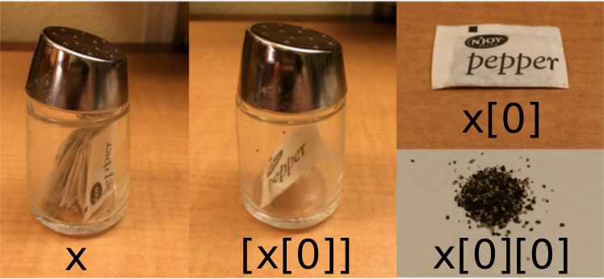

* `for` loop is a way to do many operations
* list a way to store many values
* Unlike numpy, lits are built into the language so we don't need to load 
* `[]` creates a list


```python
odds = [1,3,5,7]
```


```python
print('odds are:',odds)
```

    odds are: [1, 3, 5, 7]


```python
print('first and last:', odds[0], odds[-1])
```

    first and last: 1 7


```python
for number in odds:
    print(number)
```

    1
    3
    5
    7


### mutable and immutable objects
* diff in strings and lists: we can change vales in a list, not string
* cannot in char string


```python
names = ['Newton', 'Darwing', 'Turing'] #typo in Darwins name
print('names is orignally: ', names)
names[1] = 'Darwin'
print('final value of names:', names)
```

    names is orignally:  ['Newton', 'Darwing', 'Turing']
    final value of names: ['Newton', 'Darwin', 'Turing']


* works but how about with a string


```python
name = 'Bell'
name[0] = 'b'
```


    ---------------------------------------------------------------------------

    TypeError                                 Traceback (most recent call last)

    <ipython-input-6-220df48aeb2e> in <module>()
          1 name = 'Bell'
    ----> 2 name[0] = 'b'
    

    TypeError: 'str' object does not support item assignment


* mutable - data which can be changed in place
* immutable - data which cannot be changed in place 
* strings and numbers are immutable, can only overwrite with new vals
* lists and arrays are mutable: append, reorder, change elements
* be careful - modifying data in place if 2 vars refer to same list and you modify list value, it will change both variables! 
* make copies to avoid


```python
#nested lists
x = [['pepper', 'zucchini', 'onion'],
     ['cabbage', 'lettuce', 'garlic'],
     ['apple', 'pear', 'banana']]
```

visual representation of indexing nested lists




```python
print([x[0]])
```

    [['pepper', 'zucchini', 'onion']]


```python
print(x[0])
```

    ['pepper', 'zucchini', 'onion']


```python
print(x[0][1])
```

    zucchini


Many ways to change the contents of lists besides adding values


```python
odds.append(11)
print('odds after adding a value: ', odds)
```

    odds after adding a value:  [1, 3, 5, 7, 11, 11]


```python
del odds[0]
print('odds after removing the first element:', odds)
```

    odds after removing the first element: [5, 7, 11, 11]


```python
odds.reverse()
print('odds after reversing:', odds)
```

    odds after reversing: [11, 11, 7, 5]


1. While modifying in places - good to remember python treats list in a counterintuitive way
2. if we make a list and copy it, then modify in place, trouble ensues


```python
whos
```

    Variable   Type    Data/Info
    ----------------------------
    name       str     Bell
    number     int     7
    odds       list    n=4
    x          list    n=3


```python
odds = [1,3,5,7]
primes = odds
primes += [2]
print('primes:', primes)
print('odds:', odds)
```

    primes: [1, 3, 5, 7, 2]
    odds: [1, 3, 5, 7, 2]


they point to same list! Why?
* python stores a list in memory and then can use multiple names to refer to the same list! 
* if we want a copy instead we can use the list function so we don't do this


```python
odds = [1,3,5,7]
primes = list(odds)
primes += [2]
print('primes:', primes)
print('odds:', odds)
```

    primes: [1, 3, 5, 7, 2]
    odds: [1, 3, 5, 7]


## List challenge:

Use a for-loop to convert the string “hello” into a list of letters:

```python
["h", "e", "l", "l", "o"]
```

Hint: You can create an empty list like this:

```
my_list = []
```


```python
my_list = []
for char in "hello":
    my_list.append(char)
print(my_list)
```

    ['h', 'e', 'l', 'l', 'o']


```python

```
